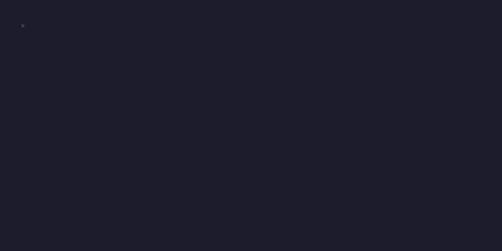

# Claude Code Event Screensaver



A terminal screensaver for Claude Code community events. Displays a shimmering CLAUDE block-art logo, rotating status messages, event info, and animated squid mascots (the Claude Code mascot) that swim across the screen.

## Requirements

- Python 3.8+
- A Unix terminal (macOS or Linux — uses `termios`/`tty`, no Windows support)
- A dark terminal theme works best

## Quick start

```bash
python screensaver.py
```

Press `q` to quit.

## Customising for your event

Edit `config.json` in the same directory as `screensaver.py`:

```json
{
  "event_date": "15 Mar 2026",
  "venue": "Your Venue",
  "wifi": "YourWifiNetwork",
  "subtitle": "CODE LA",
  "agenda": [
    {"time": "18:00", "label": "Doors open"},
    {"time": "18:30", "label": "Lightning talks"},
    {"time": "20:00", "label": "Time to go home!"}
  ]
}
```

Most events are called "Claude Code \<City\>" (e.g. Claude Code LA, Claude Code London). The big block-art title always says CLAUDE, and the `subtitle` field appears below it with auto-spacing — so set it to `"CODE LA"`, `"CODE LONDON"`, etc.

### Config options

| Field | What it does |
|---|---|
| `event_date` | Shown at the bottom of the screen |
| `venue` | Shown next to the date |
| `wifi` | WiFi network name, shown at the bottom |
| `subtitle` | Text below the CLAUDE logo, auto-spaced (e.g. `"CODE LA"`, `"CODE LONDON"`, `"CODE CURIOUS"`) |
| `agenda` | List of `{time, label}` items. The last item is treated as the "go home" item with escalating urgency effects |
| `go_home_messages` | Messages that cycle after the end time passes |
| `urgency_start_minutes_before_end` | How many minutes before the last agenda item the urgency effect begins (default: 40) |
| `verbs` | Rotating status messages shown below the subtitle |

All fields are optional — sensible defaults are built in.

## Tips for big screens

- Increase your terminal font size for readability from across the room
- Use fullscreen mode (Cmd+Ctrl+F on Terminal.app, Cmd+Enter on iTerm2) to hide the scrollbar
- A dark terminal background (black or dark blue/grey) looks best

## Features

- Shimmering warm-palette animation on the CLAUDE logo
- Squid mascots that swim with jellyfish-like propulsion
- Hearts spawn when two squids meet
- Floating particles drift upward
- The last agenda item pulses with increasing urgency as its time approaches, then cycles through custom messages after
